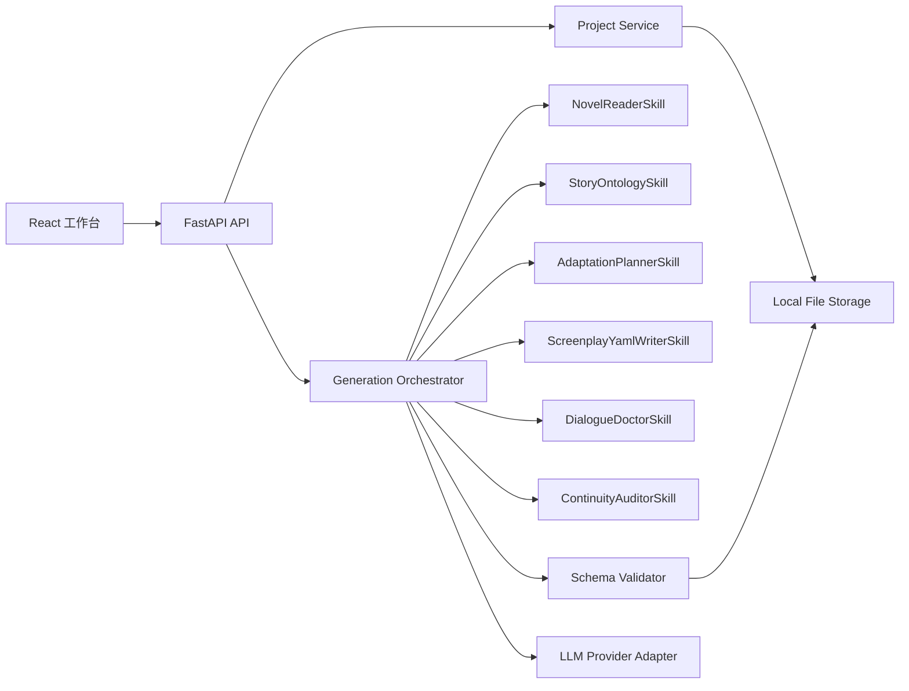

# AI 小说转剧本 MVP 前后端技术方案

## 1. 问题框架

本项目要做的不是普通的“小说文本 -> AI prompt -> 剧本文本”，而是一套面向小说作者的 AI 改编工作台：

```text
多章节小说
  -> 原著资产解析
  -> 轻量故事本体
  -> 可控改编策略
  -> 结构化剧本 YAML
  -> 因果 / 伏笔 / 潜台词审查
  -> YAML + Schema 文档导出
```

技术方案的核心目标是：

- 用 Python 承担主要业务复杂度：AI pipeline、数据模型、Schema 校验、YAML 生成、审查逻辑。
- 用前端提供高质量工作台体验：多章节输入、故事圣经、改编策略、剧本预览、审查面板。
- 用结构化数据而不是纯文本串联所有环节，保证结果可追溯、可编辑、可校验。
- 72h 内优先交付 V0 + V1 + V2 + V3 最小版，V4/V5 做高亮演示点。

## 2. 推荐技术栈

### 2.1 推荐主方案

```text
Frontend: React + TypeScript + Vite
Backend: FastAPI + Pydantic v2
Storage: backend-owned local file storage for V0+V1
AI layer: Python service layer + provider adapter
Async jobs: FastAPI BackgroundTasks for 72h MVP, RQ/Celery + Redis for production
Validation: Pydantic models + JSON Schema + custom reference checks
Export: ruamel.yaml or PyYAML
```

选择理由：

- 开发人员偏好 Python，所以把领域模型、AI 编排、Schema、YAML、审查逻辑都放在后端。
- FastAPI 与 Pydantic 天然适合“强结构 AI 输出 + API 文档 + 类型校验”。
- React 比 Streamlit/NiceGUI 更适合复杂工作台：多面板、编辑器、状态流、点击 warning 定位 scene。
- Vite 启动轻，适合 72h 项目，不引入 Next.js 的服务端渲染复杂度。

### 2.2 可选 Python-heavy 方案

如果团队极度不想写前端，可用 `FastAPI + Jinja2 + HTMX + Alpine.js`。但本项目需要 YAML 编辑器、审查定位、台词详情、可折叠故事资产面板，纯 HTMX 会在后期变重。因此建议仍采用 React，只把复杂逻辑留在 Python。

## 3. 总体架构



架构原则：

- 前端不直接拼 prompt，不直接调用模型。
- 模型输出优先要求 JSON，后端校验通过后再序列化为 YAML。对外仍导出 YAML，内部用 JSON/Pydantic 提升稳定性。
- 所有引用关系由代码校验：`character_id`、`event_id`、`scene_id`、`foreshadow_id` 不能只靠模型自觉。
- AI skill 负责创作判断，后端服务负责结构可信。

## 4. 前端方案

### 4.1 信息架构

主界面建议采用单页工作台，不做营销首页。

```text
Workbench
  Left: 原文与章节管理
  Center: 当前阶段主编辑区
  Right: 故事资产 / 审查 / YAML 摘要
```

核心 Tab：

- `导入`：章节粘贴、上传、章节拆分、字数统计、3 章校验。
- `故事圣经`：人物卡、关系、秘密、知识状态、事件、伏笔候选。
- `改编策略`：目标格式、忠实度、保留重点、台词风格。
- `剧本 YAML`：场景列表、场景详情、YAML 预览、下载。
- `审查`：Schema 错误、未兑现伏笔、知识状态冲突、台词过度解释。

### 4.2 推荐页面与组件

建议目录：

```text
frontend/
  src/
    app/
      App.tsx
      routes.tsx
    features/
      project/
      chapters/
      story-bible/
      adaptation/
      screenplay/
      audit/
      export/
    components/
      layout/
      ui/
      yaml-editor/
    api/
      client.ts
      types.ts
    state/
      project-store.ts
```

关键组件：

- `ChapterEditor`：章节列表、正文输入、自动分段、章节 ID 展示。
- `GenerationProgress`：展示 AI pipeline 当前步骤、耗时、错误。
- `StoryBiblePanel`：人物卡、关系边、秘密、知识状态。
- `AdaptationConfigPanel`：目标格式、忠实度、保留重点、台词风格。
- `SceneList`：场景卡片、来源章节、相关事件、伏笔状态。
- `SceneDetail`：动作、对白、潜台词、source refs、causal links。
- `YamlPreviewEditor`：YAML 预览、编辑、格式化、复制、下载。
- `AuditPanel`：warning 列表，点击后定位到 scene/dialogue。

### 4.3 前端状态策略

MVP 可用 TanStack Query 管服务器状态，用 Zustand 管局部 UI 状态：

- TanStack Query：项目、章节、生成结果、审查报告。
- Zustand：当前选中 tab、当前 scene、右侧面板模式、编辑器展开状态。

不建议在前端维护复杂派生业务规则。引用校验、Schema 校验、YAML 生成都交给后端。

### 4.4 前端交互重点

- 少于 3 章时禁用生成按钮，并明确提示“至少需要 3 个章节”。
- AI 生成过程使用 job 进度展示，不让用户面对长时间空白。
- 生成失败时展示阶段、错误原因、可重试按钮。
- YAML 预览支持只读和编辑两种状态，编辑后可重新校验。
- 审查 warning 必须能定位到具体 scene/dialogue，而不是只显示抽象提示。

## 5. 后端方案

### 5.1 推荐目录

```text
backend/
  app/
    main.py
    core/
      config.py
      logging.py
      errors.py
    api/
      routes_projects.py
      routes_chapters.py
      routes_generation.py
      routes_yaml.py
      routes_audit.py
    models/
      project.py
      screenplay.py
      story_bible.py
      generation.py
      audit.py
    schemas/
      screenplay_schema.py
      api.py
    services/
      project_service.py
      chapter_service.py
      generation_orchestrator.py
      yaml_service.py
      validation_service.py
      audit_service.py
    ai/
      provider.py
      prompts/
        novel_reader.md
        story_ontology.md
        adaptation_planner.md
        screenplay_writer.md
        dialogue_doctor.md
        continuity_auditor.md
      skills/
        novel_reader.py
        story_ontology.py
        adaptation_planner.py
        screenplay_writer.py
        dialogue_doctor.py
        continuity_auditor.py
    repositories/
      project_repository.py
      chapter_repository.py
      job_repository.py
      artifact_repository.py
      llm_run_repository.py
    workers/
      jobs.py
    tests/
```

### 5.2 核心领域模型

后端以 Pydantic 为主定义领域结构，local storage 以 JSON/YAML 文件承载复杂内容。

核心对象：

- `Project`：项目标题、状态、创建时间、当前版本。
- `Chapter`：`chapter_id`、标题、顺序、正文、段落数组。
- `StoryBible`：人物、关系、秘密、知识状态、voice profile。
- `Event`：关键事件、参与者、来源章节、事件类型。
- `CausalEdge`：事件因果边、关系类型、解释。
- `Foreshadowing`：setup/payoff、状态、描述。
- `AdaptationConfig`：目标格式、忠实度、保留重点、台词风格。
- `AdaptationPlan`：保留事件、合并事件、保护元素、scene plan。
- `Scene`：场景、source refs、角色、动作、对白、因果、伏笔。
- `AuditReport`：连续性、伏笔、台词、Schema warning。

### 5.3 本地文件存储

MVP 推荐：

```text
data/projects.json
data/projects/{project_id}/chapters.json
data/projects/{project_id}/jobs.json
data/projects/{project_id}/artifacts/
data/llm_runs.jsonl
```

`artifacts/` 用于保存每一步结构化结果：

- `novel_analysis`
- `story_bible`
- `adaptation_plan`
- `screenplay_json`
- `screenplay_yaml`
- `audit_report`

V0+V1 先用 backend-owned local file storage，不引入 SQLite、PostgreSQL 或迁移系统。artifact 文件按 `{artifact_type}_v###.json` 或 `{artifact_type}_v###.yaml` 命名，LLM trace 追加到 `llm_runs.jsonl`。

### 5.4 AI Pipeline

后端的 `GenerationOrchestrator` 串联六个 skill：

```text
1. NovelReaderSkill
   输入：章节 + 段落编号
   输出：人物候选、事件、地点、物件、伏笔候选、source_refs

2. StoryOntologySkill
   输入：NovelReader 输出 + 原文片段
   输出：story_bible、关系、知识状态、voice_profile

3. AdaptationPlannerSkill
   输入：story_bible、events、causal_graph、adaptation_config
   输出：adaptation_plan、scene_plan

4. ScreenplayYamlWriterSkill
   输入：scene_plan、story_bible、schema 摘要
   输出：screenplay_json

5. DialogueDoctorSkill
   输入：关键 scenes + voice profiles
   输出：dialogue subtext/action_hint 优化结果

6. ContinuityAuditorSkill
   输入：story_bible、events、foreshadowing、scenes
   输出：audit_report
```

重要设计决策：

- 模型输出尽量使用 JSON Schema，后端负责转 YAML。
- 每一步产物都落库，方便失败重试和 demo 展示。
- 每一步都做 Pydantic 校验，失败时可以调用 `YamlRepairSkill` 或 `JsonRepairSkill`。
- 生成流程允许分阶段执行：先故事圣经，再改编计划，再剧本 YAML。

### 5.5 API 设计

推荐 API：

```text
POST   /api/projects
GET    /api/projects/{project_id}

POST   /api/projects/{project_id}/chapters
PUT    /api/projects/{project_id}/chapters/{chapter_id}
POST   /api/projects/{project_id}/chapters/auto-split

POST   /api/projects/{project_id}/generate/story-bible
POST   /api/projects/{project_id}/generate/adaptation-plan
POST   /api/projects/{project_id}/generate/screenplay
POST   /api/projects/{project_id}/generate/audit

GET    /api/jobs/{job_id}
GET    /api/jobs/{job_id}/events

GET    /api/projects/{project_id}/artifacts/story-bible
GET    /api/projects/{project_id}/artifacts/screenplay
GET    /api/projects/{project_id}/artifacts/audit

POST   /api/projects/{project_id}/yaml/validate
GET    /api/projects/{project_id}/yaml/download
GET    /api/projects/{project_id}/schema/download
```

进度推送：

- 72h MVP：前端轮询 `GET /api/jobs/{job_id}`。
- 体验增强：使用 SSE `GET /api/jobs/{job_id}/events`。
- WebSocket 暂不必要。

### 5.6 Schema 与 YAML 策略

内部推荐格式：

```text
Pydantic models -> JSON object -> reference validation -> YAML export
```

不要把模型生成的 YAML 原样当最终结果。更稳的方式是：

1. 模型按 JSON Schema 输出。
2. 后端 Pydantic 校验字段与类型。
3. 后端运行引用完整性校验。
4. 通过后序列化为 YAML。
5. 用户编辑 YAML 后，再解析回 JSON 做校验。

校验分两层：

- 结构校验：字段、类型、必填项、枚举值。
- 引用校验：scene 引用的 character/event/foreshadowing 是否存在。

### 5.7 LLM Provider 抽象

建议定义 `LLMProvider` 接口，避免被单一模型 SDK 锁死：

```text
generate_structured(prompt, schema, temperature, max_tokens)
generate_text(prompt, temperature, max_tokens)
```

MVP 可以只实现一个 provider，但业务层不要直接依赖 SDK。

需要记录：

- prompt version
- model name
- request id
- token usage
- latency
- raw output
- parsed output
- validation errors

这些信息对调试 AI 输出不稳定非常关键。

## 6. 72h 交付路线

### Day 1：骨架与故事资产

目标：跑通“多章节输入 -> 故事圣经”。

后端：

- FastAPI 项目骨架。
- Pydantic 核心模型。
- Project/Chapter API。
- 章节分段与稳定 ID。
- NovelReaderSkill、StoryOntologySkill。
- artifact 保存。

前端：

- 工作台布局。
- 章节输入与 3 章校验。
- 生成进度。
- 人物卡、事件卡、伏笔候选展示。

测试重点：

- 少于 3 章不能开始生成。
- 章节 ID 稳定。
- AI 输出缺字段时返回可读错误。

### Day 2：可控改编与 YAML 输出

目标：跑通“改编策略 -> 剧本 JSON -> YAML 导出”。

后端：

- AdaptationPlannerSkill。
- ScreenplayYamlWriterSkill。
- Schema/引用校验。
- YAML 导出。

前端：

- 改编策略面板。
- 场景列表与场景详情。
- YAML 预览、复制、下载。
- source refs / related events / foreshadowing 展示。

测试重点：

- 高忠实度配置进入 generation payload。
- scene 中引用的 character_id 必须存在。
- YAML 下载内容可以被重新解析。

### Day 3：审查闭环与 demo 高光

目标：让产品看起来像“工作台”，不是生成器。

后端：

- ContinuityAuditorSkill。
- DialogueDoctorSkill 的关键场景版本。
- audit_report 生成。
- Schema 文档导出。

前端：

- 审查面板。
- warning 点击定位 scene/dialogue。
- 台词潜台词详情。
- Demo 示例数据。

测试重点：

- 未兑现伏笔进入 audit_report。
- 缺失 source_refs 进入 schema_warnings。
- 点击 warning 能定位到目标场景。

## 7. 测试方案

### 7.1 后端测试

建议测试路径：

```text
backend/app/tests/test_chapter_service.py
backend/app/tests/test_generation_orchestrator.py
backend/app/tests/test_validation_service.py
backend/app/tests/test_yaml_service.py
backend/app/tests/test_audit_service.py
```

关键场景：

- 输入 2 章时校验失败，输入 3 章时通过。
- 章节正文能稳定分段并生成 paragraph refs。
- Pydantic 能拒绝缺少 `scene.id` 或 `dialogue.character_id` 的输出。
- 引用不存在的 character/event/scene 会产生明确 warning。
- YAML 导出后能 parse 回同等结构。
- AI provider 超时或返回非法 JSON 时，job 状态变为 failed 且保留错误。

### 7.2 前端测试

建议测试路径：

```text
frontend/src/features/chapters/ChapterEditor.test.tsx
frontend/src/features/adaptation/AdaptationConfigPanel.test.tsx
frontend/src/features/screenplay/SceneDetail.test.tsx
frontend/src/features/audit/AuditPanel.test.tsx
```

关键场景：

- 少于 3 章时生成按钮 disabled。
- 生成 job 轮询中显示当前阶段。
- 场景详情正确显示 source refs、related events、foreshadowing。
- 审查 warning 点击后切换到对应 scene。
- YAML 下载按钮在无 screenplay 时 disabled。

### 7.3 端到端测试

MVP 至少保留一个 demo fixture：

```text
fixtures/demo_novel_3_chapters.json
fixtures/demo_screenplay.yaml
```

端到端路径：

```text
导入 3 章小说
  -> 生成故事圣经
  -> 选择高忠实度 + 保留伏笔
  -> 生成剧本 YAML
  -> 查看审查 warning
  -> 下载 YAML
```

## 8. 非目标与边界

本轮不做：

- 预算风险模块。
- 图数据库和 RDF/OWL 本体。
- 多人协作。
- Final Draft / Fountain 导出。
- 复杂可视化图谱。
- 生产级计费、权限、团队空间。

可以预留但不实现：

- PostgreSQL JSONB。
- Redis 队列。
- 多模型 fallback。
- 版本 diff。
- 人工批注协作。

## 9. 关键风险与应对

### 风险：AI 输出不稳定

应对：

- 模型输出 JSON，后端转 YAML。
- 每步 Pydantic 校验。
- 保存 raw output 和 parsed output。
- 校验失败进入 repair skill 或要求重试。

### 风险：Scope 过大

应对：

- V0-V3 是主体交付。
- V4 只做 1-2 场关键戏的高质量台词潜台词。
- V5 审查先做列表，不做复杂图谱。

### 风险：前端工作台复杂

应对：

- 单页工作台 + Tabs。
- 列表和详情优先，不做拖拽图谱。
- 后端返回可直接展示的结构化摘要。

### 风险：Python 后端承担过多 AI 耗时任务

应对：

- 72h 用 BackgroundTasks + local job state。
- 超出 MVP 后切到 RQ/Celery + Redis。
- 每个 pipeline step 可单独重试。

## 10. 推荐最小可交付版本

最小但有说服力的交付组合：

```text
1. 多章节输入与 3 章校验
2. 故事圣经生成：人物、关系、事件、伏笔候选
3. 改编策略选择：目标格式、忠实度、保留重点
4. 剧本 YAML 生成：scene、action、dialogue、source_refs
5. 因果/伏笔最小审查：未兑现伏笔、缺失引用
6. YAML + Schema 文档导出
```

这套范围既贴合原方案，也最能体现技术亮点：

- 可控改编，而不是黑箱生成。
- 轻量故事本体，而不是一次性文本。
- Schema 约束输出，而不是靠 prompt 祈祷。
- Python 后端保证结构可信，前端提供创作者可理解的工作台。
